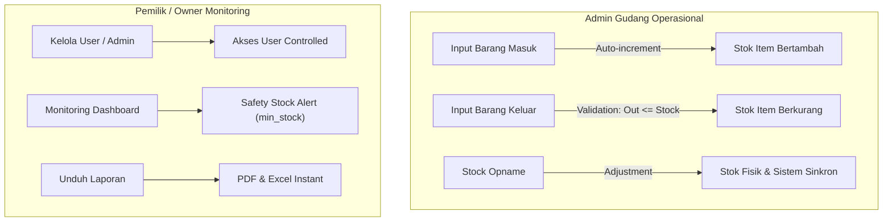

# 01. Project Scope — Gudang Diesel Truk Medan

## 1. Informasi Proyek

**Nama Proyek:** SIM Stok Gudang Diesel Truk Medan  
**Referensi:** Proposal Skripsi Jojor Maruba Hutabarat (22100052) — ITB Indonesia  
**Kapasitas Gudang:** ±50 jenis suku cadang / sparepart dengan total ±2.000 unit barang.  

Dokumen ini menjadi **batas utama pengembangan proyek**.

---

## 2. Tujuan Proyek

Mengotomatisasi pencatatan transaksi persediaan barang berbasis web untuk menggantikan buku pencatatan manual, memantau persediaan secara real-time, meminimalisasi selisih data stok fisik vs buku, serta mempercepat penyusunan laporan persediaan dari hitungan hari menjadi detik.

---

## 3. Aktor Sistem

Sistem memiliki 2 aktor utama berbasis **Spatie Role-Based Access Control (RBAC)**:

### 3.1 Admin Gudang (Operational Access)
- Login / logout akun.
- Mengelola Master Data Sparepart, Kategori, Satuan, dan Supplier.
- Menginput transaksi **Barang Masuk** (Auto-increment stok).
- Menginput transaksi **Barang Keluar** (Auto-decrement + Proteksi Stok Minus).
- Melakukan **Stock Opname** (Penyesuaian stok akibat barang rusak/hilang).
- Memantau Dashboard Monitoring & Safety Stock Alert.
- Meninjau, mencetak, dan mengunduh Laporan Persediaan.

### 3.2 Pemilik / Owner (Managerial & Monitoring Access)
- Login / logout akun.
- Mengelola akun pengguna / admin gudang (`/users`).
- Memantau statistik persediaan & grafik mutasi pada Dashboard Monitoring.
- Meninjau, mencetak, serta mengunduh Laporan Persediaan (PDF & Excel).
- *Catatan Constraint:* Owner **tidak diizinkan** menginput/mengubah transaksi mutasi barang dan master data operasional guna menjaga integritas data.

---

## 4. Scope Diagram Alur Transaksi

