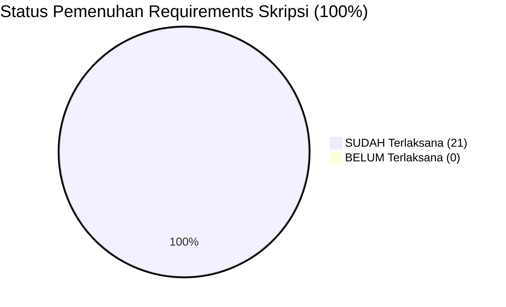

# 02. Functional & Non-Functional Requirements

## 1. Functional Requirements (FR)

### 1.1 Modul Master Data (Sparepart & Reference)
- **FR-MST-01:** Admin dapat mengelola Master Data Sparepart (kode barang, nama barang, lokasi rak, stok awal, stok minimum).
- **FR-MST-02:** Admin dapat mengelola Kategori Barang, Satuan Unit (cth: Pcs, Set, Dus), dan Supplier.
- **FR-MST-03:** Sistem menggunakan Soft Deletes (`deleted_at`) untuk seluruh master data.

### 1.2 Modul Transaksi & Stock Opname
- **FR-TRX-01:** Admin dapat menginput Barang Masuk dari Supplier yang secara otomatis **menambah stok**.
- **FR-TRX-02:** Admin dapat menginput Barang Keluar untuk mekanik/truk yang secara otomatis **mengurangi stok**.
- **FR-TRX-03 (Proteksi Stok Minus):** Transaksi barang keluar wajib menolak pengeluaran jika $\text{Jumlah Keluar} > \text{Stok Sisa}$.
- **FR-TRX-04 (Stock Opname):** Admin dapat menyesuaikan selisih stok fisik vs sistem akibat barang rusak/hilang.

### 1.3 Modul User Management & RBAC
- **FR-USR-01:** Pemilik (Owner) & Admin Gudang dapat mengelola akun pengguna (`GET`, `POST`, `PUT`, `DELETE /users`).
- **FR-USR-02:** Pemilik tidak dapat diakseskan ke route mutasi barang/master data operasional (*Read-Only*).

### 1.4 Modul Laporan & Dashboard
- **FR-REP-01:** Dashboard menampilkan total stok, mutasi barang, Area Chart (`recharts`), dan *Safety Stock Alert* (`min_stock`).
- **FR-REP-02:** Sistem dapat mencetak (Print), mengunduh PDF (DomPDF), dan Excel (PhpSpreadsheet) laporan persediaan.

---

## 2. Requirement Verification Matrix (21/21 Checklist Selesai)

| No | Requirement Skripsi | Status | Verified Code Location |
|:---:|:---|:---:|:---|
| 1 | Pencatatan Otomatis & Real-Time | [x] SUDAH | Inertia.js v3 + React 19 SPA |
| 2 | Pencegahan Mismatch Stok | [x] SUDAH | Transactional Atomicity Eloquent |
| 3 | Penyusunan Laporan Instan | [x] SUDAH | ReportController (DomPDF & Excel) |
| 4 | Metodologi Prototype & Flow UX | [x] SUDAH | Pest Automated Tests (48 Passed) |
| 5 | Tech Stack Backend: Laravel 13 (PHP 8.5) | [x] SUDAH | `laravel/framework ^13.17` |
| 6 | Tech Stack Frontend: React 19 + Tailwind v4 | [x] SUDAH | `resources/js/pages/*.tsx` |
| 7 | Bridge Library: Inertia.js v3 | [x] SUDAH | `@inertiajs/react ^3.0` |
| 8 | Database: MySQL 8.0 & Eloquent ORM | [x] SUDAH | `database/migrations/*.php` |
| 9 | Auth & RBAC: Fortify + Spatie RBAC | [x] SUDAH | `spatie/laravel-permission` |
| 10 | Hak Akses Admin Gudang (Operational) | [x] SUDAH | Middleware `role:admin` |
| 11 | Hak Akses Pemilik / Owner (Managerial) | [x] SUDAH | Middleware `role:admin\|pemilik` di `/users` |
| 12 | Proteksi Read-Only Transaksi Owner | [x] SUDAH | Route Middleware Intercept |
| 13 | Dashboard Monitoring & Chart | [x] SUDAH | `resources/js/pages/dashboard.tsx` |
| 14 | Safety Stock Alert (`min_stock`) | [x] SUDAH | `min_stock` Alert Badge |
| 15 | Pengelolaan Master Data | [x] SUDAH | Item, Category, Unit, Supplier Controllers |
| 16 | Barang Masuk (Auto-increment) | [x] SUDAH | IncomingItemController@store |
| 17 | Barang Keluar (Auto-decrement) | [x] SUDAH | OutgoingItemController@store |
| 18 | Proteksi Stok Minus | [x] SUDAH | Validation in OutgoingItemController |
| 19 | Stock Opname / Penyesuaian Stok | [x] SUDAH | StockAdjustmentController |
| 20 | Laporan PDF, Excel, & Print | [x] SUDAH | ReportController PDF/Excel Export |
| 21 | Pengujian Black-Box & Automated Test | [x] SUDAH | `tests/Feature/*.php` (48 Passed) |
