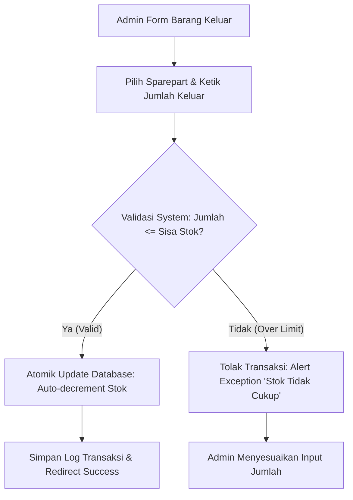

# 03. User Flow & Process Diagrams — Gudang Diesel Truk Medan

## 1. Core End-to-End Operational Business Flow

Alur utama pengelolaan stok persediaan barang pada Gudang Diesel Truk Medan disajikan dalam diagram Mermaid berikut:

```mermaid
sequenceDiagram
    autonumber
    actor A as Admin Gudang
    participant SYS as "SIM Stok Gudang Diesel"
    actor O as Pemilik / Owner

    A->>SYS: Login Auth (Fortify + Spatie RBAC)
    SYS-->>A: Dashboard Monitoring & Safety Stock Alert

    rect rgb(15, 23, 42)
        note right of A: Alur Barang Masuk (Restock Supplier)
        A->>SYS: Input Transaksi Barang Masuk (Pilih Supplier & Jumlah)
        SYS->>SYS: Auto-increment Stok: Stok Baru = Stok Lama + Jumlah
        SYS-->>A: Stok Ter-update Real-time
    end

    rect rgb(15, 23, 42)
        note right of A: Alur Barang Keluar (Pengeluaran Mekanik)
        A->>SYS: Input Transaksi Barang Keluar (Pilih Item & Jumlah)
        alt Jumlah Keluar <= Sisa Stok
            SYS->>SYS: Auto-decrement Stok: Stok Baru = Stok Lama - Jumlah
            SYS-->>A: Transaksi Berhasil & Stok Berkurang
        else Jumlah Keluar > Sisa Stok
            SYS-->>A: Error Exception: Stok Tidak Mencukupi (Proteksi Stok Minus)
        end
    end

    rect rgb(15, 23, 42)
        note right of A: Alur Stock Opname (Penyesuaian Barang Rusak/Hilang)
        A->>SYS: Input Physical Stock & Alasan Selisih
        SYS->>SYS: Adjustment Audit Log & Sync Stok Fisik
        SYS-->>A: Stok Fisik & Sistem Sinkron 100%
    end

    O->>SYS: Login Pemilik
    SYS-->>O: Access User Management & Export Laporan PDF/Excel
```

---

## 2. Detail Alur Transaksi Barang Keluar & Proteksi Stok Minus

