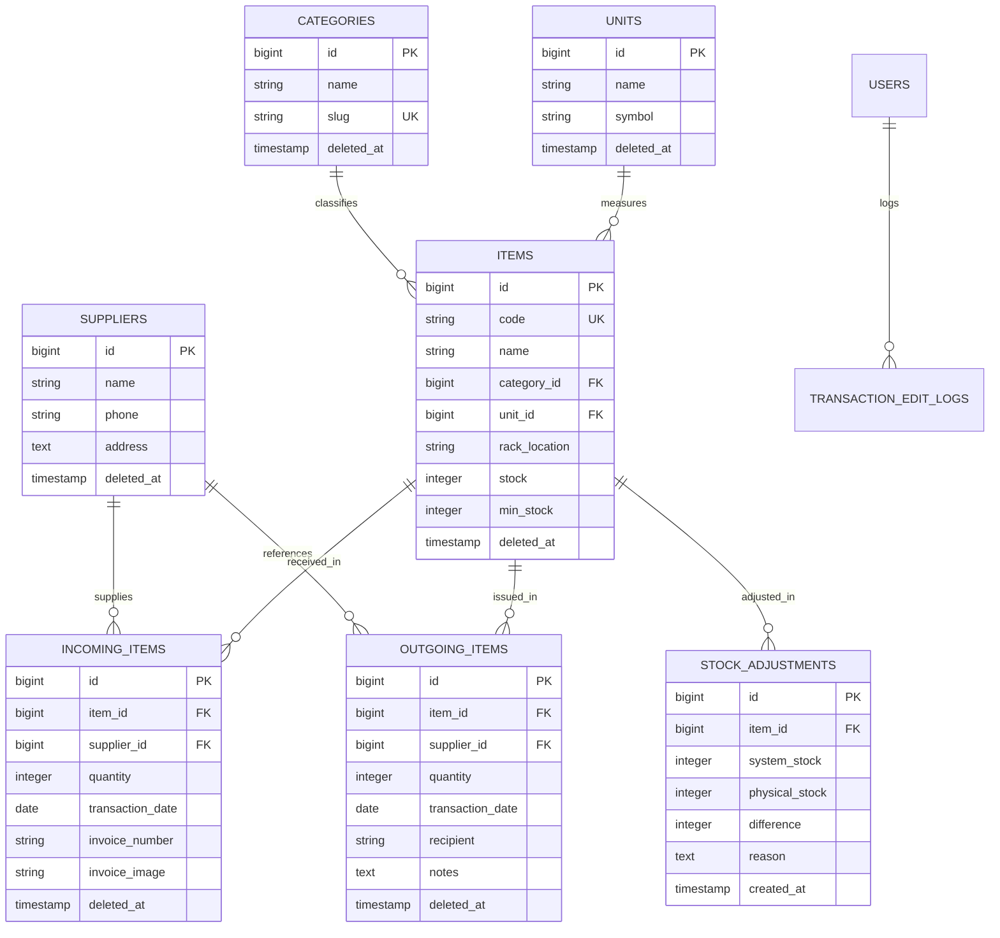

# 08. Data Model & Database Schema — Gudang Diesel Truk Medan

## 1. Entity Relationship Diagram (ERD)

---

## 2. Table Specifications

### 2.1 `items` (Master Sparepart)
| Column Name | Type | Constraints | Description |
| :--- | :--- | :--- | :--- |
| `id` | BigIncrements | Primary Key | ID Item Sparepart |
| `code` | String | Unique, Not Null | Kode Unik Sparepart (cth: `SPR-001`) |
| `name` | String | Not Null | Nama Suku Cadang |
| `category_id` | ForeignId | Constrained `categories` | ID Kategori Barang |
| `unit_id` | ForeignId | Constrained `units` | ID Satuan Unit |
| `rack_location` | String | Nullable | Lokasi Rak Penyimpanan (cth: `Rak A-02`) |
| `stock` | Integer | Default `0` | Sisa Stok Fisik Real-time |
| `min_stock` | Integer | Default `5` | Ambang Batas Minimum Safety Stock |
| `deleted_at` | Timestamp | Nullable | **Soft Delete** |

### 2.2 `incoming_items` (Transaksi Barang Masuk)
| Column Name | Type | Constraints | Description |
| :--- | :--- | :--- | :--- |
| `id` | BigIncrements | Primary Key | ID Transaksi Masuk |
| `item_id` | ForeignId | Constrained `items` | Barang yang Diterima |
| `supplier_id` | ForeignId | Constrained `suppliers` | Supplier Penyedia |
| `quantity` | Integer | Not Null | Jumlah Unit Diterima |
| `transaction_date` | Date | Not Null | Tanggal Transaksi Masuk |
| `invoice_number` | String | Nullable | Nomor Faktur / Surat Jalan |
| `invoice_image` | String | Nullable | Path Foto Bukti Faktur |
| `deleted_at` | Timestamp | Nullable | **Soft Delete** |

### 2.3 `outgoing_items` (Transaksi Barang Keluar)
| Column Name | Type | Constraints | Description |
| :--- | :--- | :--- | :--- |
| `id` | BigIncrements | Primary Key | ID Transaksi Keluar |
| `item_id` | ForeignId | Constrained `items` | Barang yang Dikeluarkan |
| `quantity` | Integer | Not Null | Jumlah Unit Dikeluarkan |
| `transaction_date` | Date | Not Null | Tanggal Pengeluaran |
| `recipient` | String | Nullable | Penerima (Mekanik / No. Truk) |
| `notes` | Text | Nullable | Catatan Peruntukan Barang |
| `deleted_at` | Timestamp | Nullable | **Soft Delete** |

### 2.4 `stock_adjustments` (Stock Opname)
| Column Name | Type | Constraints | Description |
| :--- | :--- | :--- | :--- |
| `id` | BigIncrements | Primary Key | ID Stock Opname |
| `item_id` | ForeignId | Constrained `items` | Barang yang Disesuaikan |
| `system_stock` | Integer | Not Null | Jumlah Stok Menurut Sistem |
| `physical_stock` | Integer | Not Null | Jumlah Stok Fisik Hasil Opname |
| `difference` | Integer | Not Null | Selisih ($Physical - System$) |
| `reason` | Text | Nullable | Alasan Adjustment (Rusak/Hilang) |
