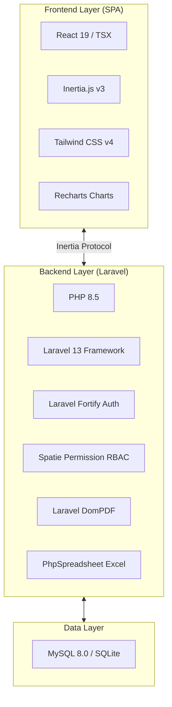

# 12. Technical Guidelines & Stack Architecture

## 1. Stack Technology Overview

---

## 2. Key Commands
- `php artisan serve`: Running local dev server.
- `npm run dev`: Running Vite dev server.
- `php artisan test --compact`: Running Pest automated tests (48 Passed).
- `vendor/bin/pint --dirty --format agent`: Code formatting.
