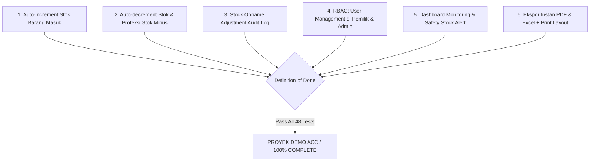

# 15. Acceptance Criteria & Definition of Done

## 1. Quality Gate Overview

---

## 2. Checklist Verification Criteria

- [x] Transaksi **Barang Masuk** secara otomatis menambah jumlah stok item pada database.
- [x] Transaksi **Barang Keluar** secara otomatis mengurangi jumlah stok item pada database.
- [x] Transaksi **Barang Keluar** wajib menolak pengeluaran jika jumlah keluar melebihi stok sisa (**Proteksi Stok Minus**).
- [x] **Stock Opname** dapat menyimpan selisih fisik vs sistem dan meng-update persediaan fisik riil secara atomik.
- [x] **Pemilik (Owner)** dan **Admin** dapat mengelola akun pengguna (`/users`).
- [x] **Pemilik (Owner)** dilindungi middleware dari melakukan mutasi transaksi operasional (*Read-Only Transaction*).
- [x] **Dashboard Monitoring** menampilkan total stok, mutasi barang, grafik `recharts`, dan visual badge *Safety Stock Alert* (`min_stock`).
- [x] Laporan persediaan dan mutasi dapat diekspor secara instan ke format **PDF** (`barryvdh/laravel-dompdf`) dan **Excel** (`phpoffice/phpspreadsheet`).
- [x] Seluruh skenario fungsional terverifikasi lulus **48 Pest Automated Unit & Feature Tests**.
