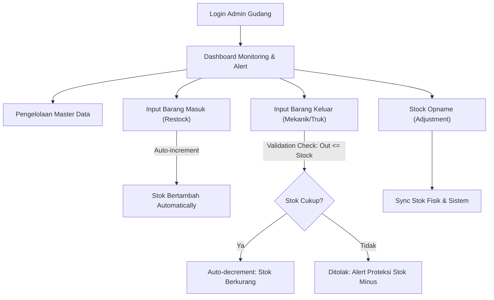

# Panduan Operasional Lengkap — Admin Gudang

> **Sistem Informasi Manajemen Stok Barang Gudang Diesel Truk Medan**  
> **Aktor:** Admin Gudang (Operational Access)  
> **Hak Akses:** Full Operasional (Master Data, Mutasi Barang Masuk/Keluar, Stock Opname, Monitoring, Laporan)

---

## 1. Pendahuluan & Alur Kerja Utama

Sebagai **Admin Gudang**, Anda bertanggung jawab secara penuh terhadap operasional fisik dan pencatatan persediaan suku cadang (sparepart) di Gudang Diesel Truk Medan. Sistem ini dirancang untuk memastikan pencatatan stok berjalan secara otomatis (*Auto-increment* & *Auto-decrement*), konsisten, serta bebas dari kesalahan selisih stok fisik vs buku.

---

## 2. Modul Master Data Sparepart & Referensi

### 2.1 Menambah Master Data Sparepart Baru
1. Buka menu **Master Data** ➔ **Sparepart** (`/items`).
2. Klik tombol **+ Tambah Sparepart**.
3. Isi formulir dengan data yang akurat:
   - **Kode Barang (Unik):** Contoh `SPR-001` (Filter Oli), `FLT-002` (Filter Solar).
   - **Nama Sparepart:** Nama lengkap suku cadang mesin diesel truk.
   - **Kategori:** Pilih kategori (cth: *Filter*, *Mesin*, *Oli & Pelumas*).
   - **Satuan Unit:** Pilih satuan (cth: *Pcs*, *Set*, *Unit*, *Dus*).
   - **Lokasi Rak:** Rak penyimpanan di gudang fisik (cth: *Rak A-02*).
   - **Stok Awal:** Jumlah persediaan awal saat pendataan.
   - **Stok Minimum (`min_stock`):** Ambang batas aman persediaan (cth: `5`). Apabila sisa stok $\le$ stok minimum, sistem akan menampilkan peringatan visual kuning/merah di Dashboard.
4. Klik **Simpan**.

### 2.2 Mengelola Kategori, Satuan Unit & Supplier
- **Kategori (`/categories`):** Tambah/edit jenis sparepart untuk mempermudah pemfilteran.
- **Satuan Unit (`/units`):** Pendataan satuan barang baku yang digunakan gudang.
- **Supplier (`/suppliers`):** Pendataan distributor penyedia sparepart lengkap dengan nama, nomor telepon, dan alamat kantor.

---

## 3. Transaksi Barang Masuk (Restock Supplier)

### 3.1 Alur Input Barang Masuk
1. Buka menu **Transaksi** ➔ **Barang Masuk** (`/incoming-items`).
2. Klik tombol **+ Input Barang Masuk**.
3. Lengkapi formulir transaksi:
   - **Tanggal Penerimaan:** Tanggal barang tiba di gudang.
   - **Pilih Sparepart:** Cari nama atau kode barang yang diterima.
   - **Pilih Supplier:** Distributor pengirim barang.
   - **Jumlah Diterima:** Ketik jumlah unit yang diterima (wajib angka positif).
   - **Nomor Faktur / Surat Jalan:** Masukkan nomor bukti faktur dari supplier.
   - **Upload Bukti Invoice (Opsional):** Lampirkan foto/scan surat jalan.
4. Klik **Simpan Transaksi**.
5. **Efek Sistem:** Sistem secara otomatis mengeksekusi *Auto-increment*:
   $$\text{Stok Baru} = \text{Stok Lama} + \text{Jumlah Barang Masuk}$$

---

## 4. Transaksi Barang Keluar & Proteksi Stok Minus

### 4.1 Alur Input Barang Keluar
1. Buka menu **Transaksi** ➔ **Barang Keluar** (`/outgoing-items`).
2. Klik tombol **+ Input Barang Keluar**.
3. Lengkapi formulir transaksi:
   - **Tanggal Pengeluaran:** Tanggal barang dikeluarkan dari gudang.
   - **Pilih Sparepart:** Pilih nama barang yang diambil mekanik.
   - **Jumlah Keluar:** Ketik jumlah unit yang dikeluarkan.
   - **Penerima:** Nama mekanik atau Nomor Plat Truk peruntukan.
   - **Catatan / Keterangan:** Alasan perbaikan/peruntukan barang.
4. Klik **Simpan Transaksi**.

### 4.2 Aturan Proteksi Stok Minus
Sistem memvalidasi jumlah pengeluaran secara real-time:
- **Jika $\text{Jumlah Keluar} \le \text{Sisa Stok}$:** Transaksi berhasil disimpan, dan stok berkurang secara *Auto-decrement*:
  $$\text{Stok Baru} = \text{Stok Lama} - \text{Jumlah Barang Keluar}$$
- **Jika $\text{Jumlah Keluar} > \text{Sisa Stok}$:** Sistem menolak transaksi dan menampilkan pesan kesalahan:
  > ❌ **Gagal:** Jumlah pengeluaran melebihi sisa stok yang tersedia di gudang!

---

## 5. Stock Opname / Penyesuaian Stok (Adjustment)

Fitur ini digunakan jika terjadi perbedaan jumlah antara catatan di sistem dengan fisik riil di gudang akibat barang rusak atau hilang saat penyimpanan.

### 5.1 Alur Pelaksanaan Stock Opname
1. Buka menu **Stock Opname** (`/stock-adjustments`).
2. Klik tombol **+ Input Stock Opname**.
3. Pilih nama sparepart yang akan disesuaikan.
4. Masukkan **Jumlah Stok Fisik Riil** hasil pengecekan di rak gudang.
5. Sistem me-hitung selisih secara otomatis:
   $$\text{Selisih} = \text{Stok Fisik} - \text{Stok Sistem}$$
6. Masukkan **Alasan Penyesuaian** (cth: *2 unit rusak terkena oli*, *1 unit hilang saat pecah dus*).
7. Klik **Simpan Adjustment**.
8. **Efek Sistem:** Stok sistem akan disinkronkan 100% mengikuti jumlah fisik riil dan tercatat pada *Audit Trail Log*.

---

## 6. Laporan Persediaan & Cetak PDF / Excel

1. Buka menu **Laporan** (`/reports`).
2. Tentukan **Rentang Tanggal** (Awal s/d Akhir) dan Filter Kategori jika diperlukan.
3. Pilih Format Output:
   - 🖨️ **Cetak (Print):** Buka tampilan layout cetak bersih untuk printer.
   - 📄 **Download PDF:** Mengunduh berkas laporan format PDF (DomPDF).
   - 📊 **Download Excel:** Mengunduh berkas spreadsheet (PhpSpreadsheet).

---

## 7. Troubleshooting & Pertanyaan Sering Diajukan (FAQ)

- **Q: Apakah Admin bisa menghapus data transaksi barang masuk/keluar?**  
  *A:* Sistem menggunakan *Soft Deletes*. Transaksi yang dihapus akan masuk ke arsip sampah dan stok akan disesuaikan kembali secara otomatis.
- **Q: Mengapa tombol Simpan Barang Keluar berwarna merah?**  
  *A:* Karena jumlah barang yang Anda ketik melebihi stok yang tersedia saat ini (Proteksi Stok Minus aktif).
