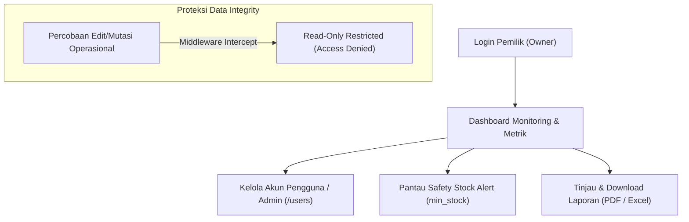

# Panduan Manajerial Lengkap — Pemilik (Owner)

> **Sistem Informasi Manajemen Stok Barang Gudang Diesel Truk Medan**  
> **Aktor:** Pemilik Gudang / Owner (Managerial & Monitoring Access)  
> **Hak Akses:** Manajerial Akun Pengguna, Monitoring Dashboard Real-time, Meninjau & Mengunduh Laporan Persediaan (PDF & Excel).

---

## 1. Pendahuluan & Peran Manajerial

Sebagai **Pemilik (Owner)**, peran utama Anda dalam sistem ini adalah pengawasan (*supervision*) dan pengambil keputusan manajerial pengadaan suku cadang berdasarkan data persediaan yang *real-time* dan akurat. 

Sistem secara khusus memberikan akses pengelolaan akun staf/admin gudang kepada Anda, sembari menerapkan **Proteksi Constraint Read-Only Transaksi** agar mutasi operasional barang tidak dapat diubah secara langsung oleh Pemilik demi menjaga integritas dan akuntabilitas audit data.

---

## 2. Pengelolaan Akun Pengguna (User Management)

Pemilik memiliki kewenangan penuh mengelola akun pengguna/admin gudang pada menu `/users`.

### 2.1 Menambah Akun Admin Gudang / Staf Baru
1. Buka menu **Kelola Pengguna** (`/users`).
2. Klik tombol **+ Tambah Pengguna Baru**.
3. Isi formulir pendaftaran akun:
   - **Nama Lengkap:** Nama pengelola gudang (cth: *Budi Santoso*).
   - **Email Login:** Alamat email resmi staf (cth: *budi@gudangdiesel.com*).
   - **Password:** Kata sandi minimal 8 karakter.
   - **Role / Peran:** Pilih `Admin Gudang` (Operasional) atau `Pemilik (Owner)` (Manajerial).
4. Klik **Simpan**.

### 2.2 Memperbarui atau Menghapus Akses Akun
- **Edit User:** Klik ikon **Edit (Pensil)** pada baris nama pengguna untuk mengubah nama, email, password, atau role.
- **Hapus User:** Klik ikon **Hapus (Tempat Sampah)** untuk mencabut akses login pengguna.  
  *Catatan Keamanan:* Anda tidak diizinkan menghapus akun Anda sendiri yang sedang digunakan untuk login aktif.

---

## 3. Monitoring Dashboard & Safety Stock Alert

### 3.1 Indikator Persediaan & Grafik Mutasi
- **Metrik Utama:** Menampilkan Total Jenis Sparepart, Total Unit Persediaan, Total Barang Masuk Bulan Ini, dan Total Barang Keluar Bulan Ini.
- **Area Chart Mutasi (`recharts`):** Grafik visual perbandingan volume barang masuk dari supplier vs pengeluaran barang untuk truk/mekanik secara bulanan.

### 3.2 Alert Stok Kritis (`min_stock`)
Tabel **Peringatan Safety Stock** otomatis menampilkan item-item sparepart yang stok fisiknya sudah berada pada atau di bawah stok minimum.
- 🟡 **Status Warning (Kuning):** Sisa stok mendekati batas minimum.
- 🔴 **Status Kritis (Merah):** Sisa stok $\le 2$ unit / kehabisan stok.  
*Tindakan Manajerial:* Pemilik dapat langsung membuat keputusan pengadaan (*purchase order*) ke supplier berdasarkan alert ini.

---

## 4. Meninjau & Mengunduh Laporan Persediaan (PDF & Excel)

1. Buka menu **Laporan Persediaan** (`/reports`).
2. Filter laporan berdasarkan **Periode Tanggal** (misal: *01 September 2026 s/d 30 September 2026*).
3. Pilih metode ekspor instan:
   - 📄 **Export PDF:** Menghasilkan berkas laporan format PDF resmi siap cetak (DomPDF).
   - 📊 **Export Excel:** Menghasilkan berkas spreadsheet XLS/XLSX untuk analisis data (PhpSpreadsheet).
   - 🖨️ **Cetak (Print):** Buka jendela cetak langsung pada peramban web.

---

## 5. Ringkasan Hak Akses & Keamanan

| Modul System | Akses Pemilik (Owner) | Keterangan Proteksi |
| :--- | :---: | :--- |
| **User Management (`/users`)** | ✅ **Full Access** | Tambah, Edit, Hapus akun admin/staf gudang. |
| **Dashboard Monitoring** | ✅ **Full Access** | Tampilan statistik, grafik, & alert sisa stok. |
| **Laporan Persediaan** | ✅ **Full Access** | Filter tanggal, cetak, download PDF & Excel. |
| **Master Data Operasional** | 👁️ **Read-Only** | Hanya melihat data (tidak diizinkan simpan/edit). |
| **Input Barang Masuk / Keluar** | ❌ **No Access** | Mutasi operasional khusus diinput Admin Gudang. |
| **Input Stock Opname** | 👁️ **Read-Only** | Hanya dapat melihat riwayat adjustment. |
